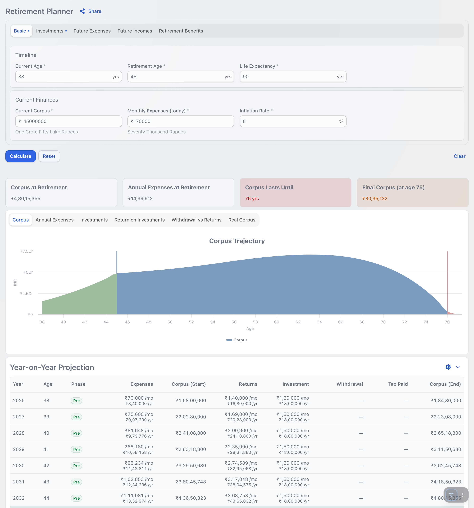

# Calculators

A small suite of personal-finance calculators — a [Vaadin](https://vaadin.com)
(Spring Boot) web app. Pick a calculator, enter your numbers, and get an instant
year-by-year projection with charts and a shareable link.

### A quick look

The Retirement Planner — live summary cards, an interactive projection chart,
and a year-by-year breakdown that all recompute as you type:



**Calculators included:**

| Calculator | What it answers |
|---|---|
| Retirement Planner | Will my corpus last through retirement? Projects cashflow to life expectancy. |
| Goal Planner | How much must I invest monthly to hit a post-tax goal by a deadline? |
| Investment | What does a regular contribution grow to over an invest-and-hold horizon? |
| Loan / EMI | What's my EMI, and how do prepayments cut the tenure or interest? |
| Inflation Projection | What will an amount be worth across a horizon — forward or backward? |
| Buy vs Rent | Is buying a home better than renting and investing the difference? |

**Your data stays in your browser.** Inputs and preferences are saved to the
browser's `localStorage` — there's no database and nothing is sent to a server
to be stored. A "Share" link encodes the scenario into the URL itself, so
sharing is opt-in and self-contained.

Supports three currencies (₹ INR, € EUR, $ USD) and a light/dark theme.

---

## Run it (self-hosting)

A prebuilt, multi-architecture image (`linux/amd64` + `linux/arm64`) is published
to Docker Hub at **[`binarycodes/calculators`](https://hub.docker.com/r/binarycodes/calculators)**.
No build, no license key, no configuration required.

```bash
docker run --rm -p 8080:8080 binarycodes/calculators:latest
```

Then open <http://localhost:8080>.

- Use `binarycodes/calculators:latest` for the newest build, or pin a version
  tag — images are also tagged with the project's Maven version.
- The app listens on port **8080**. Override it with the `PORT` environment
  variable: `-e PORT=9090 -p 9090:9090`.

### docker compose

```yaml
services:
  calculators:
    image: binarycodes/calculators:latest
    ports:
      - "8080:8080"
    restart: unless-stopped
```

### Podman Quadlet (systemd)

If you run [Podman](https://podman.io), a [Quadlet](https://docs.podman.io/en/latest/markdown/podman-systemd.unit.5.html)
lets systemd manage the container declaratively — start on boot, restart on
failure, and optional auto-updates — without a long-running daemon. Drop this in
`/etc/containers/systemd/calculators.container` (rootful) or
`~/.config/containers/systemd/calculators.container` (rootless):

```ini
[Unit]
Description=Calculators web app
After=network-online.target
Wants=network-online.target

[Container]
Image=docker.io/binarycodes/calculators:latest
PublishPort=8080:8080
# Opt in to `podman auto-update` pulling newer :latest images.
AutoUpdate=registry

[Service]
Restart=always

[Install]
# multi-user.target for rootful; default.target for a rootless --user unit.
WantedBy=multi-user.target default.target
```

Then reload systemd and start it (add `--user` for the rootless path):

```bash
systemctl daemon-reload
systemctl start calculators.service
```

With `AutoUpdate=registry`, enabling `podman-auto-update.timer` keeps the
container on the latest published image.

### Serve over HTTPS (recommended)

Run the app behind a TLS-terminating reverse proxy (Caddy, Traefik, nginx, your
cloud load balancer, …). Beyond the usual security reasons, **two features only
work in a secure context (HTTPS, or `localhost`)**:

- the **Share** button's native share sheet (browser Web Share API), and
- copying the share link to the clipboard.

Over plain HTTP on a LAN address (e.g. `http://192.168.1.10:8080`) the browser
hides these APIs: the calculators work fully, but the Share button falls back to
"Copy link" and, on iOS, the clipboard write is suppressed by the browser. Put
the app behind HTTPS and the native share sheet appears automatically — no app
configuration needed.

A minimal Caddy reverse proxy (automatic HTTPS) looks like:

```
calc.example.com {
    reverse_proxy calculators:8080
}
```

---

## Develop locally

Requirements: **JDK 21** and Maven (a `./mvnw` wrapper is included).

```bash
./mvnw spring-boot:run
```

Open <http://localhost:8080>. `localhost` counts as a secure context, so the
Web Share / clipboard features work here too. The frontend is rebuilt on the
fly in development mode; the first start downloads npm dependencies and takes a
little longer.

To exercise those secure-context features from another device (e.g. the Share
sheet on a phone), expose your local server over HTTPS with a quick
[Cloudflare Tunnel](https://developers.cloudflare.com/cloudflare-one/connections/connect-networks/do-more-with-tunnels/trycloudflare/)
— no account or DNS setup needed:

```bash
cloudflared tunnel --url http://localhost:8080
```

It prints a temporary `https://<random>.trycloudflare.com` URL that proxies to
your running app; open it on the device under test. (`ngrok http 8080` does the
same thing.)

> This app uses commercial Vaadin components. The first time one renders in
> development, Vaadin Dev Tools prompts you to sign in to `vaadin.com` or start a
> free trial. See [Vaadin license](#build-your-own-image) below.

Run the tests:

```bash
./mvnw test
```

---

## Build your own image

Production build (fat jar in `target/`):

```bash
./mvnw clean package
```

Build a container — the repo ships a multi-stage `Dockerfile` and a
`docker-bake.hcl` for multi-arch builds:

```bash
# single-arch, local
docker build -t calculators:latest \
  --build-arg APP_NAME=calculators \
  --build-arg APP_VERSION=1.0.0-SNAPSHOT .

# multi-arch (amd64 + arm64) via Buildx Bake
docker buildx bake
```

> **Vaadin license:** this app uses **commercial Vaadin components**, so building
> it requires one of:
>
> - **A valid [Vaadin subscription](https://vaadin.com/pricing)** (no banner).
>   On a local machine the license is validated through your `vaadin.com` login
>   (stored at `~/.vaadin/proKey`). For a CI / Docker build, pass it as the
>   `VAADIN_SERVER_LICENSE` build arg (wired through to `-Dvaadin.offlineKey`) or
>   mount your `proKey` as a build secret.
> - **A trial build with the opt-in flag `-Dvaadin.commercialWithBanner`.** A
>   production build does *not* enable commercial components without a license
>   unless you opt in with this flag, which builds them in but shows a persistent
>   banner at the bottom of the page at runtime:
>
>   ```bash
>   ./mvnw clean package -Dvaadin.commercialWithBanner
>   ```
>
> The license is checked at build time, not at runtime. The prebuilt Docker Hub
> image is built with a license, so **running it needs no key and shows no
> banner**.

---

## How it's published

`binarycodes/calculators` on Docker Hub is built and pushed automatically by the
GitHub Actions **CI** workflow: on every push to `main`, the Docker image is
built and published **only after `mvn verify` passes** (the `docker` job is
gated on the `verify` job). Images are signed with [cosign](https://github.com/sigstore/cosign)
and ship with provenance + SBOM attestations.
